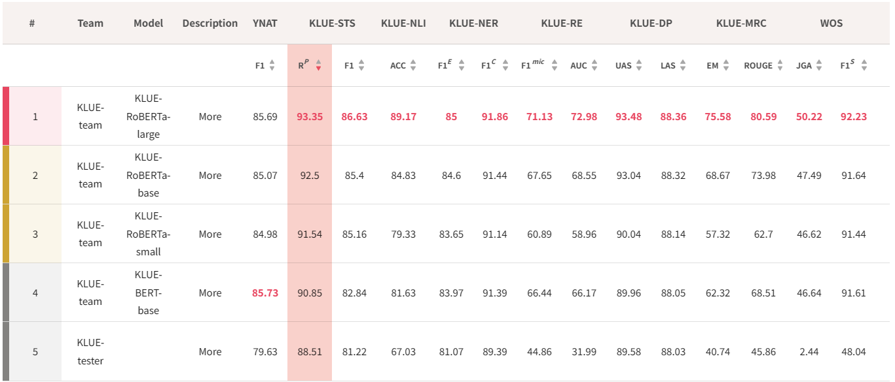
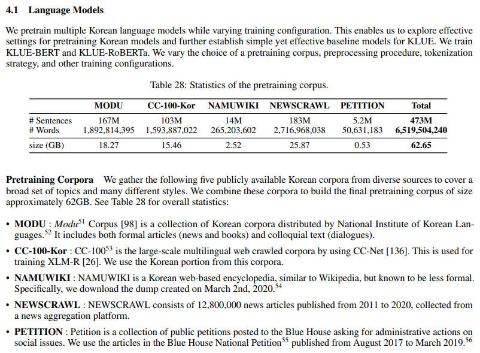
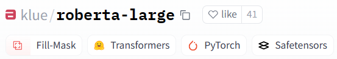

# AI 시행착오 기록

## Methodology
- Image from PapersWithCode
 

주어진 모범답안과 학생답안에 대해 의미론적으로 유사한가를 판별하는 
STS(Sematic Textual Similarity) task로 정의하여 채점 진행

## Dataset & Model Selection 
KLUE dataset 참고(https://arxiv.org/pdf/2105.09680.pdf)  

해당 논문의 KLUE-STS dataset에서 다음과 같은 네 모델의 성능지표를 확인할 수 있음  

- KLUE-RoBERTa-large : 93.35/ 86.63
- KLUE-RoBERTa-base : 92.5 / 85.4
- KLUE-RoBERTa-small : 91.54 / 85.16
- KLUE-BERT-base : 90.85 / 81.63

benchmark 지표상에서 KLUE-RoBERTa-large 모델이 가장 좋은 성능을 보임
  

KLUE 논문의 저자들이 MODU, CC-100-Kor 등 대량의 corpus로 학습된 Pretrained Language Model을 Hugging Face를 통해 공유함.  
이를 목적에 맞게 KLUE-STS dataset으로 fine-tuning을 진행하여 한국어 문장 유사도 모델을 만들고자함.

## Fine-Tuning
